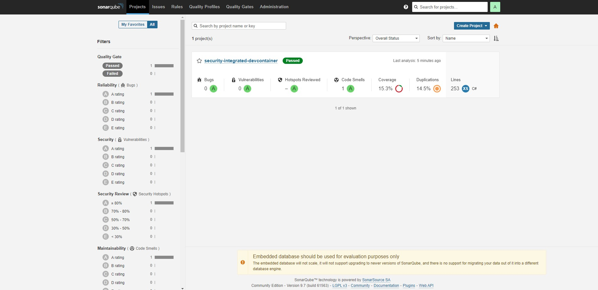
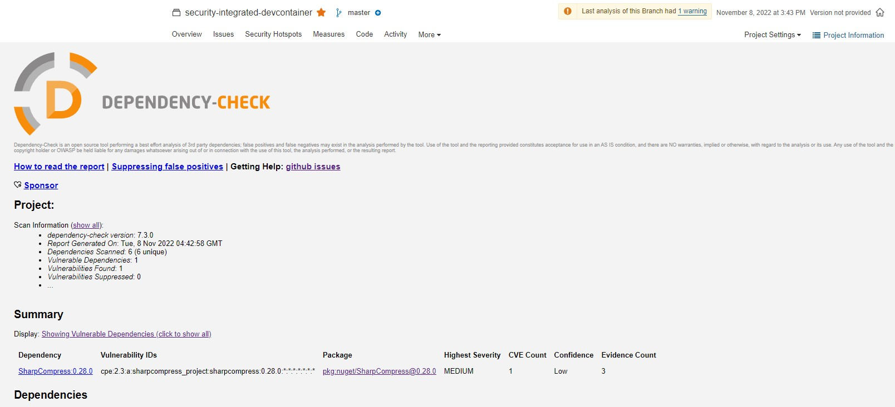
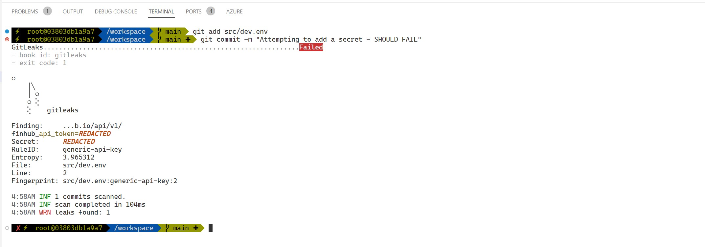

# Overview
This is a sample that demonstrates how to use a [VSCode DevContainer](https://code.visualstudio.com/docs/remote/containers) to integrate security tools into your local development workflow. The preconfigured dev-container has following tools integrated via docker compose and git hooks.  
* **Static Application Security Testing (SAST)**: Community edition of [SonarQube](https://www.sonarqube.org/) runs on the `docker-compose` environment and code is scanned upon every commit by using a Git hook on the local repo.
* **Software Composition Analysis (SCA)**: [OWASP Dependency Check Tool](https://owasp.org/www-project-dependency-track/) checks dependencies against known vulnerabilities upon every code commit using a Git hook. Results are published to SonarQube via a [SonarQube Plugin](https://github.com/dependency-check/dependency-check-sonar-plugin)  
* **Secret Scanning**:  [GitLeaks](https://github.com/zricethezav/gitleaks) runs on pre-commit hook and prevents any secrets from being checked into the source code repository.  

# How to run?
## Pre-requisites
You will need the following prerequisites in order to run the devcontainer and accompanying .NET code sample:  
- VSCode with [Dev Containers](https://marketplace.visualstudio.com/items?itemName=ms-vscode-remote.remote-containers) extension installed.
- Docker version with Docker Compose support.
- Generate a free API key from [Finhub](https://finnhub.io/) to run the code sample
- If you are using a Linux Docker Host, set below parameters on the host as root (explained [here](https://hub.docker.com/_/sonarqube))
```bash
sysctl -w vm.max_map_count=262144
sysctl -w fs.file-max=131072
ulimit -n 131072
ulimit -u 8192
```
## Steps
Follow the below below steps:
- Open this repository in VSCode
- Command Pallete -> "Dev Containers: Rebuild and Reopen in Container"
- View "Show Log" (from the notification) and wait for the DevContainer to build. On the first run, this may take few minutes to download all the docker images.
- Integrated Terminal -> Add "zsh" terminal
- Open SonarQube on http://localhost:9000. Default username is "admin" and the password is "admin". Change the "admin" password to something else and update the `.devcontainer\local.env` -> `SQ_PASSWORD` to new value.
- Open Dependency Track on http://localhost:8080. Default username is "admin" and the password is "admin". Change the "admin" account password to something else and log back in using the new password.
- In Depdendency Track -> Administration -> Access Management -> Teams, add "PROJECT_CREATION_UPLOAD" permission to the "Automation" team. Copy it's API key and update it in the `.devcontainer\local.env` -> `DT_AUTH_TOKEN`.
- Create a `.env` file inside `.devcontainer` directory and include the Finhub API key to run the code sample.
    ```
    finhub_api_baseUrl=https://finnhub.io/api/v1/
    finhub_api_token=<API key from Finhub>
    ```
- Command Pallete -> "Dev Containers: Rebuild Container".
- Press F5 to run the sample API.
- Open http://localhost:7071/api/swagger.json to interact with the API.

# How to use?
## SAST (SonarQube)
Sonar scan runs on every commit. You will see security issues, code smells, coverage and more in SonarQube (http://localhost:9000):  

You can manually trigger a code scan by running `/workspace/.devcontainer/scripts/run-code-scan.sh`.

## SCA (OWASP Dependency Check)
Dependency tracking runs on every commit. You will see any known vulnerabilities recorded as vulnerabilities in SonarQube (http://localhost:9000):  

You can manually trigger a dependency scan by running `/workspace/.devcontainer/scripts/run-code-scan.sh`.

## Secret Scanning (GitLeaks)
Secret scanning runs on pre-commit. It will fail the commit if secrets are found in the commit:  

You can manually trigger a secret scan across the entire repository by running `/workspace/.devcontainer/scripts/run-secret-scan.sh`.